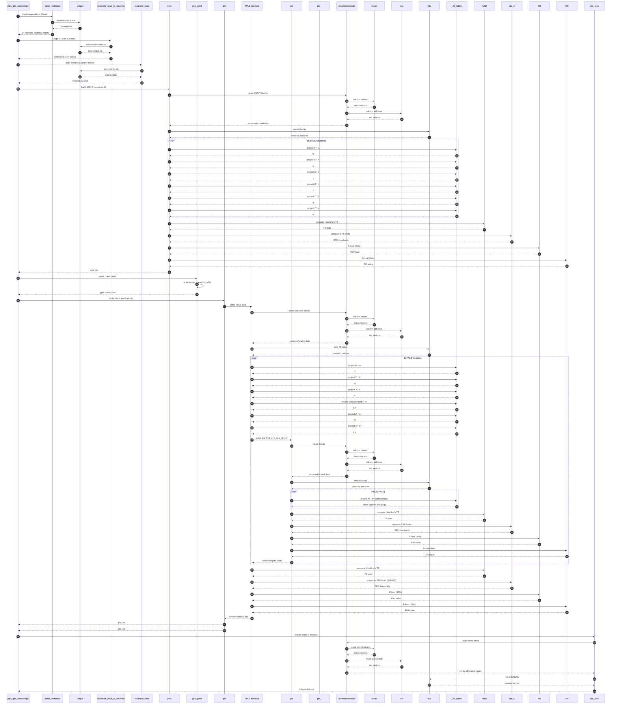

## JRPLS/TPLS Call Sequence

```mermaid
sequenceDiagram
    autonumber

    participant Script as jrpls_tpls_example.py
    participant ParseMaterials as parse_materials
    participant Unique as unique
    participant ReconcileRC as reconcile_rows_to_columns
    participant ReconcileRows as reconcile_rows
    participant JRPLS as jrpls
    participant JRPred as jrpls_pred
    participant TPLS as tpls
    participant TPLSPrep as TPLS internals
    participant PLS as pls
    participant PLSCore as pls_
    participant Meancenter as meancenterscale
    participant Mean as mean
    participant Std as std
    participant N2Z as n2z
    participant AbBtBinv as _Ab_btbinv
    participant Hott2 as hott2
    participant SpeCI as spe_ci
    participant F95 as f95
    participant F99 as f99
    participant TPred as tpls_pred

    Script->>ParseMaterials: load compositions (Excel)
    ParseMaterials->>Unique: list materials & lots
    Unique-->>ParseMaterials: ordered ids
    ParseMaterials-->>Script: JR matrices, material names

    Script->>ReconcileRC: align JR with Xi blocks
    ReconcileRC->>Unique: column intersections
    Unique-->>ReconcileRC: intersected ids
    ReconcileRC-->>Script: reconciled Xi/Ri blocks

    Script->>ReconcileRows: align process & quality tables
    ReconcileRows->>Unique: common lot ids
    Unique-->>ReconcileRows: ordered lots
    ReconcileRows-->>Script: merged AUX list

    Script->>JRPLS: build JRPLS model (A=4)
    JRPLS->>Meancenter: scale Xi/Ri/Y blocks
    Meancenter->>Mean: column means
    Mean-->>Meancenter: mean vectors
    Meancenter->>Std: column std devs
    Std-->>Meancenter: std vectors
    Meancenter-->>JRPLS: centered/scaled data
    JRPLS->>N2Z: zero-fill NaNs
    N2Z-->>JRPLS: masked matrices
    loop NIPALS iterations
        JRPLS->>AbBtBinv: project R' * u
        AbBtBinv-->>JRPLS: hi
        JRPLS->>AbBtBinv: project X' * h
        AbBtBinv-->>JRPLS: si
        JRPLS->>AbBtBinv: project X * s
        AbBtBinv-->>JRPLS: ri
        JRPLS->>AbBtBinv: project R * r
        AbBtBinv-->>JRPLS: ti
        JRPLS->>AbBtBinv: project Y' * t
        AbBtBinv-->>JRPLS: qi
        JRPLS->>AbBtBinv: project Y * q
        AbBtBinv-->>JRPLS: ui
    end
    JRPLS->>Hott2: compute Hotelling's T2
    Hott2-->>JRPLS: T2 stats
    JRPLS->>SpeCI: compute SPE limits
    SpeCI-->>JRPLS: SPE thresholds
    JRPLS->>F95: F-limit (95%)
    F95-->>JRPLS: F95 value
    JRPLS->>F99: F-limit (99%)
    F99-->>JRPLS: F99 value
    JRPLS-->>Script: jrpls_obj

    Script->>JRPred: predict new blend
    JRPred->>JRPred: scale inputs (mean/std, n2z)
    JRPred-->>Script: jrpls predictions

    Script->>TPLS: build TPLS model (A=4)
    TPLS->>TPLSPrep: enter TPLS loop
    TPLSPrep->>Meancenter: scale Xi/Ri/Z/Y blocks
    Meancenter->>Mean: column means
    Mean-->>Meancenter: mean vectors
    Meancenter->>Std: column std devs
    Std-->>Meancenter: std vectors
    Meancenter-->>TPLSPrep: centered/scaled data
    TPLSPrep->>N2Z: zero-fill NaNs
    N2Z-->>TPLSPrep: masked matrices
    loop NIPALS iterations
        TPLSPrep->>AbBtBinv: project R' * u
        AbBtBinv-->>TPLSPrep: hi
        TPLSPrep->>AbBtBinv: project X' * h
        AbBtBinv-->>TPLSPrep: si
        TPLSPrep->>AbBtBinv: project X * s
        AbBtBinv-->>TPLSPrep: ri
        TPLSPrep->>AbBtBinv: project concatenated R * r
        AbBtBinv-->>TPLSPrep: t_rx
        TPLSPrep->>AbBtBinv: project Z' * u
        AbBtBinv-->>TPLSPrep: wi
        TPLSPrep->>AbBtBinv: project Z * w
        AbBtBinv-->>TPLSPrep: t_z
        TPLSPrep->>PLS: solve 1LV PLS on [t_rx, t_z] vs Y
        PLS->>Meancenter: scale inputs
        Meancenter->>Mean: column means
        Mean-->>Meancenter: mean vectors
        Meancenter->>Std: column std devs
        Std-->>Meancenter: std vectors
        Meancenter-->>PLS: centered/scaled data
        PLS->>N2Z: zero-fill NaNs
        N2Z-->>PLS: masked matrices
        loop PLS NIPALS
            PLS->>AbBtBinv: project X* / Y* combinations
            AbBtBinv-->>PLS: latent vectors (w,t,q,u,p)
        end
        PLS->>Hott2: compute Hotelling's T2
        Hott2-->>PLS: T2 stats
        PLS->>SpeCI: compute SPE limits
        SpeCI-->>PLS: SPE thresholds
        PLS->>F95: F-limit (95%)
        F95-->>PLS: F95 value
        PLS->>F99: F-limit (99%)
        F99-->>PLS: F99 value
        PLS-->>TPLSPrep: latent weights/loads
    end
    TPLSPrep->>Hott2: compute Hotelling's T2
    Hott2-->>TPLSPrep: T2 stats
    TPLSPrep->>SpeCI: compute SPE limits (X/R/Z/Y)
    SpeCI-->>TPLSPrep: SPE thresholds
    TPLSPrep->>F95: F-limit (95%)
    F95-->>TPLSPrep: F95 value
    TPLSPrep->>F99: F-limit (99%)
    F99-->>TPLSPrep: F99 value
    TPLSPrep-->>TPLS: assembled tpls_obj
    TPLS-->>Script: tpls_obj
    TPLS-->>Script: tpls_obj

    Script->>TPred: predict blend + process
    TPred->>Meancenter: scale rnew, znew
    Meancenter->>Mean: reuse stored means
    Mean-->>Meancenter: mean vectors
    Meancenter->>Std: reuse stored stds
    Std-->>Meancenter: std vectors
    Meancenter-->>TPred: centered/scaled inputs
    TPred->>N2Z: zero-fill NaNs
    N2Z-->>TPred: masked inputs
    TPred-->>Script: tpls predictions
```

