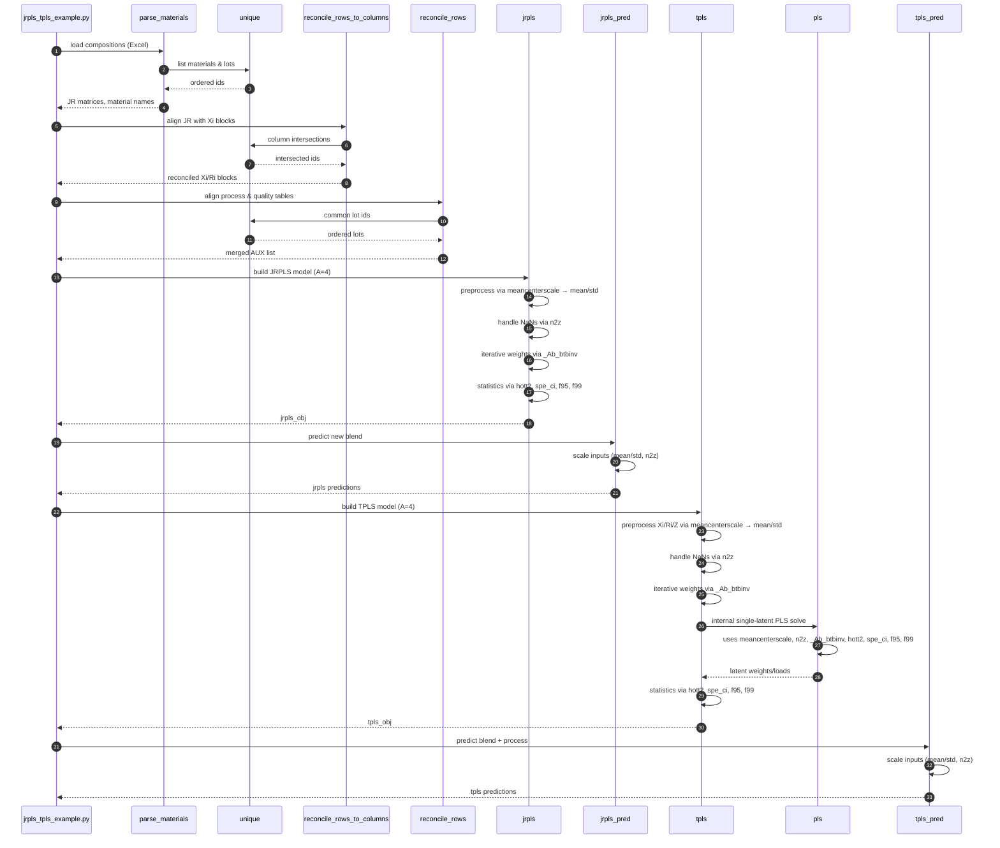

## JRPLS/TPLS Call Sequence

```mermaid
sequenceDiagram
    autonumber

    participant Script as jrpls_tpls_example.py
    participant ParseMaterials as parse_materials
    participant Unique as unique
    participant ReconcileRC as reconcile_rows_to_columns
    participant ReconcileRows as reconcile_rows
    participant JRPLS as jrpls
    participant JRPred as jrpls_pred
    participant TPLS as tpls
    participant PLS as pls
    participant TPred as tpls_pred

    Script->>ParseMaterials: load compositions (Excel)
    ParseMaterials->>Unique: list materials & lots
    Unique-->>ParseMaterials: ordered ids
    ParseMaterials-->>Script: JR matrices, material names

    Script->>ReconcileRC: align JR with Xi blocks
    ReconcileRC->>Unique: column intersections
    Unique-->>ReconcileRC: intersected ids
    ReconcileRC-->>Script: reconciled Xi/Ri blocks

    Script->>ReconcileRows: align process & quality tables
    ReconcileRows->>Unique: common lot ids
    Unique-->>ReconcileRows: ordered lots
    ReconcileRows-->>Script: merged AUX list

    Script->>JRPLS: build JRPLS model (A=4)
    JRPLS->>JRPLS: preprocess via meancenterscale → mean/std
    JRPLS->>JRPLS: handle NaNs via n2z
    JRPLS->>JRPLS: iterative weights via _Ab_btbinv
    JRPLS->>JRPLS: statistics via hott2, spe_ci, f95, f99
    JRPLS-->>Script: jrpls_obj

    Script->>JRPred: predict new blend
    JRPred->>JRPred: scale inputs (mean/std, n2z)
    JRPred-->>Script: jrpls predictions

    Script->>TPLS: build TPLS model (A=4)
    TPLS->>TPLS: preprocess Xi/Ri/Z via meancenterscale → mean/std
    TPLS->>TPLS: handle NaNs via n2z
    TPLS->>TPLS: iterative weights via _Ab_btbinv
    TPLS->>PLS: internal single-latent PLS solve
    PLS->>PLS: uses meancenterscale, n2z, _Ab_btbinv, hott2, spe_ci, f95, f99
    PLS-->>TPLS: latent weights/loads
    TPLS->>TPLS: statistics via hott2, spe_ci, f95, f99
    TPLS-->>Script: tpls_obj

    Script->>TPred: predict blend + process
    TPred->>TPred: scale inputs (mean/std, n2z)
    TPred-->>Script: tpls predictions
```

